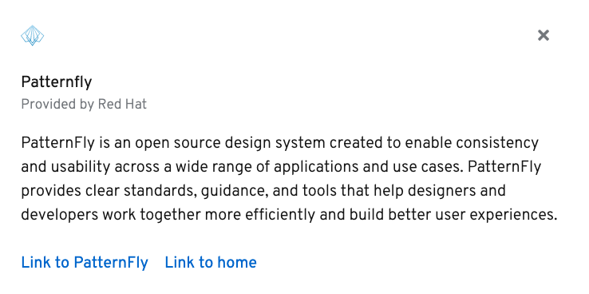

A card is a flexible element for containing any kind of content. Cards are used on dashboards, in data displays, or for positioning content on a page.

In this exercise, we'll be creating a card with an image, action, header, body, and footer.

In PatternFly 4, separate components are used to demarcate the different regions of a card so it can be fully customized. For example, images are placed in CardHead, actions in CardActions, and the header in CardHeader.  We'll a PatternFly card  - the image below is what we'll end up with when we are done. 

## Task
Katacoda is setting up a new React application for you. You'll be ready to code once the server starts and you can see "Welcome to PatternFly" on the lower pane.

1) Navigate to the `src` folder and open `App.js`

2) Set up the imports we'll need and the general structure of the card

Copy the following code into the App.js file:

<pre class="file" data-filename="App.js" data-target="replace">
import React from 'react';
import &quot;@patternfly/react-core/dist/styles/base.css&quot;;
import {
  Brand,
  Button,
  Card,
  CardActions,
  CardHead,
  CardHeader,
  CardBody,
  CardFooter,
  Split,
  SplitItem,
  Text,
  TextContent,
  TextVariants
} from '@patternfly/react-core';
import {
  TimesIcon
} from '@patternfly/react-icons';

function App() {
  return (
    &lt;Card&gt;
      &lt;CardHead&gt;
        &lt;CardActions&gt;
        &lt;/CardActions&gt;
      &lt;/CardHead&gt;
      &lt;CardHeader&gt;
      &lt;/CardHeader&gt;
      &lt;CardBody&gt;
      &lt;/CardBody&gt;
      &lt;CardFooter&gt;
      &lt;/CardFooter&gt;
    &lt;/Card&gt;
  );
}

export default App;
</pre>

Once it reloads - it should look like this:

